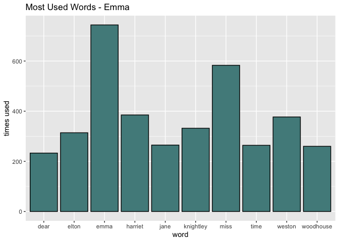

B4
================
Nat
2023-12-06

``` r
library(tidyverse)
```

    ## ── Attaching core tidyverse packages ──────────────────────── tidyverse 2.0.0 ──
    ## ✔ dplyr     1.1.3     ✔ readr     2.1.4
    ## ✔ forcats   1.0.0     ✔ stringr   1.5.0
    ## ✔ ggplot2   3.4.3     ✔ tibble    3.2.1
    ## ✔ lubridate 1.9.2     ✔ tidyr     1.3.0
    ## ✔ purrr     1.0.2     
    ## ── Conflicts ────────────────────────────────────────── tidyverse_conflicts() ──
    ## ✖ dplyr::filter() masks stats::filter()
    ## ✖ dplyr::lag()    masks stats::lag()
    ## ℹ Use the conflicted package (<http://conflicted.r-lib.org/>) to force all conflicts to become errors

# Exercise 1

``` r
library(tidytext)
library(janeaustenr)

#Choose partial
full <- janeaustenr::emma

#Prepare text
partial <- paste(full, collapse = " ") #remove ""
partial <- str_replace_all(partial, pattern = "\\\\", replacement = "") # Remove slashes
partial <- str_replace_all(partial, pattern = "\\n", replacement = "") #Remove new line
partial <- str_replace_all(partial, pattern = "[:punct:]", replacement = "") #Remove punctuation
partial <- tolower(partial) #words that are in both capital and lowercase will not be double counted

partial_df <- tibble(Text = partial) #Make tibble for analysis

partial_words <- partial_df %>% #unnest
    unnest_tokens(output = word, input = Text) 

partial_words  <- partial_words  %>%
    anti_join(stop_words) # Remove stop words 
```

    ## Joining with `by = join_by(word)`

``` r
#Word Counts
  
partial_wordcounts <- partial_words  %>% count(word, sort = TRUE)
use <- slice(partial_wordcounts,(1:10))
use
```

    ## # A tibble: 10 × 2
    ##    word          n
    ##    <chr>     <int>
    ##  1 emma        744
    ##  2 miss        583
    ##  3 harriet     385
    ##  4 weston      377
    ##  5 knightley   332
    ##  6 elton       314
    ##  7 jane        265
    ##  8 time        264
    ##  9 woodhouse   260
    ## 10 dear        233

# Plot data

``` r
ggplot(data = use, aes(y=n, x=word)) +
  geom_col(colour="black",fill="darkslategray4") +
  xlab("word") +
  ylab("times used") +
  ggtitle("Most Used Words - Emma")
```

<!-- -->

# Assignment 2

``` r
#' Fig Latin
#'
#' Rules:
#' 1) Arrangement: If a word starts with a vowel, the first letter is removed and will be added after the arrangement component
#'    If the word starts with a consonant, all letters leading to the first vowel are removed and will be added after the arrangement component
#' 
#' 2) Addition: If a word starts with a vowel, "ta" is added to the beginning of the word, and "ta" + letter removed from arrangement component are added to the end of the word
#'    If a word starts with a consonant, "at" is added to the beginning of the word, and "ta" + letter(s) removed from arrangement component are added to the end of the word
#'
#' @param word 
#'
#' @return character string altered by fig_latin
#' 
#' @examples 
#' fig_latin("art") #returns "tarttaa"
#' fig_latin("piece") #returns "atiecetap"
#' fig_latin("priest") #return "atiesttapr"
#' fig_latin("scram") #returns "atamtascr"
#' 

fig_latin <- function(word){
  if(!is.character(word) || length(word) != 1) {
    stop("input must a single word made of characters")
  }
  
  vowel <- c("a","e","i","o","u")
  consonant <- c("b", "c", "d", "f", "g", "h", "j", "k", "l", "m", "n", "p", "q", "r", "s", "t", "v", "w", "x", "y", "z")

  word <- tolower(word)
  
  #maybe adjust arrangement so it's more different from pig latin
  
  if (str_sub(word,1,1) %in% vowel) {
    body <- str_sub(word,2,-1)
    end <- str_sub(word,1,1)
    return(paste0("ta",body,"ta",end))
  }
  
  if (str_sub(word,1,1) %in% consonant & str_sub(word,2,2) %in% vowel) {
    body <- str_sub(word,2,-1)
    end <- str_sub(word,1,1)
    return(paste0("at",body,"ta",end))
  }
  
  cons2 <- str_sub(word,1,1) %in% consonant & str_sub(word,2,2) %in% consonant
  
  if (cons2 & str_sub(word,3,3) %in% vowel) {
    body <- str_sub(word,3,-1)
    end <- str_sub(word,1,2)
    return(paste0("at",body,"ta",end))
  } else{
    body <- str_sub(word,4,-1)
    end <- str_sub(word,1,3)
    return(paste0("at",body,"ta",end))
  }
}
```

# Examples

``` r
set.seed(321)
example_words <- sample(stringr::words, 5) #random words
example_words #to see all words sampled
```

    ## [1] "confer" "early"  "force"  "then"   "yes"

``` r
fig_latin(example_words[1]) #word: confer
```

    ## [1] "atonfertac"

``` r
fig_latin(example_words[2]) #word: early
```

    ## [1] "taarlytae"

``` r
fig_latin(example_words[3]) #word: force
```

    ## [1] "atorcetaf"

``` r
fig_latin(example_words[4]) #word: then
```

    ## [1] "atentath"

``` r
fig_latin(example_words[5]) #word: yes
```

    ## [1] "atestay"

# Tests

``` r
library(testthat)
```

    ## 
    ## Attaching package: 'testthat'

    ## The following object is masked from 'package:dplyr':
    ## 
    ##     matches

    ## The following object is masked from 'package:purrr':
    ## 
    ##     is_null

    ## The following objects are masked from 'package:readr':
    ## 
    ##     edition_get, local_edition

    ## The following object is masked from 'package:tidyr':
    ## 
    ##     matches

``` r
test_that( "Testing for functionality of fig_latin",{
  expect_equal(fig_latin("across"), "tacrosstaa") #vowel
  expect_equal(fig_latin("measure"),"ateasuretam") #consonant, vowel
  expect_equal(fig_latin("clothes"), "atothestacl") #consonant, consonant, vowel
  expect_equal(fig_latin("splurge"), "aturgetaspl") #consonant, consonant, consonant, vowel
} )
```

    ## Test passed 🥳

``` r
test_that( "Must be Character String",{
  expect_error(fig_latin(123)) #must be character string
  expect_error(fig_latin(NA)) #cannot be NA
})
```

    ## Test passed 🎉

``` r
test_that( "Capital letter are changed to lowercase and accepted" ,{
  expect_equal(fig_latin("CHARGE"), fig_latin("charge"))
  expect_equal(fig_latin("CHARGE"), "atargetach")
})
```

    ## Test passed 😀
